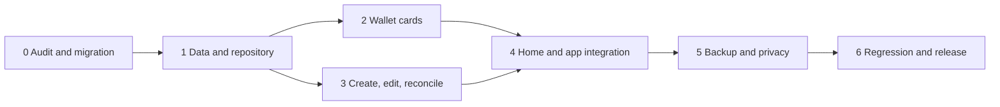

# Wave Accounts and E-Wallet Cards — Implementation Plan

## Objective

Extend Wave's completed account-card CRUD system with first-class **E-wallet
cards**. A user must be able to enter a wallet's current value, use that wallet
for income, expenses, transfers, plans, and savings, and safely correct the
displayed value while Wave remains completely offline.

## Product decision

E-wallets are **manually managed local accounts** in this phase.

- Wave does not log in to, synchronize with, or move money through an e-wallet
  provider.
- A provider name is visual identity only; it does not imply an integration.
- Current value is calculated from opening value, recorded activity, transfers,
  and explicit balance reconciliations.
- The UI must say **Manual balance** or **Updated in Wave**, never Connected,
  Synced, or Live.
- Wave should store only an optional nickname or last four identifier digits.
  It should not request or store a full phone number, wallet PIN, OTP, password,
  or recovery credential.

## Current implementation status

### Completed account foundation

- Compact and full account cards
- Home account strip
- Account details and account-filtered activity
- Create and Update forms with confirmation
- Archive, Restore, and safe permanent Delete
- Dependency and last-active-account protections
- Balance privacy, reduced motion, responsive layouts, and automated coverage
- `E-wallet` already exists in the shared supported account-type list

### E-wallet extension completed on August 18, 2026

- Provider identity and optional masked identifier
- Dedicated compact and full e-wallet card treatment
- Provider-aware create and edit fields
- Manual value reconciliation and compensating Undo adjustments
- Wallet-specific detail actions, filters, status copy, and negative-value warning
- Backup, restore, CSV, migration, privacy, and dependency coverage
- 96 passing automated tests and clean static analysis

## Scope

### Included

- Generic e-wallets plus editable provider names
- Suggested providers such as GCash, Maya, ShopeePay, and GrabPay
- Custom provider option so the feature is not tied to a fixed list
- Initial wallet value during creation
- Calculated current wallet value
- Expense, income, transfer, scheduled activity, and savings selectors
- Manual balance reconciliation
- Create, Read, Update, Archive, Restore, and safe Delete
- Privacy hiding and encrypted-backup support

### Deferred

- Provider APIs and automatic balance synchronization
- Sending money, cashing in, or cashing out through Wave
- OTP, QR payment, or wallet authentication
- Automatic fees, rewards, vouchers, and transaction imports
- Foreign-exchange conversion

## Data model

### Account additions

Add nullable fields to `Accounts`:

| Field | Purpose |
|---|---|
| `walletProviderName` | User-visible provider, including custom providers |
| `walletProviderKey` | Optional stable visual preset such as `gcash` or `maya` |
| `walletIdentifierSuffix` | Optional final four digits only |
| `walletLastReconciledAt` | Last explicit manual value check |

Rules:

- These fields are valid only when `typeName == 'E-wallet'`.
- Provider name is required for an e-wallet; a custom value is allowed.
- Identifier suffix accepts zero to four digits and is never required.
- Changing an ordinary account into an e-wallet requires provider details.
- Changing an e-wallet into another type preserves ledger history but clears
  provider-only presentation metadata after confirmation.

### Balance reconciliations

Add an `AccountBalanceAdjustments` table:

- `id`
- `accountId`
- `differenceMinor`
- `observedBalanceMinor`
- `note`
- `createdAt`

Calculated balance becomes:

`opening balance + income - expense + transfers in - transfers out + adjustments`

Adjustments must:

- affect only the selected account balance;
- remain excluded from income, expense, budget, and savings-rate reports;
- appear in account activity as **Balance adjustment**;
- be backed up and restored;
- be reversible through a compensating adjustment rather than silent deletion.

## E-wallet card design

### Compact Home card

Each compact wallet card shows:

- provider monogram or generic phone-wallet icon;
- wallet nickname and provider name;
- optional masked suffix such as `••42`;
- current calculated value;
- `Manual` status and last reconciliation date;
- privacy-hidden state when balances are concealed.

Use a restrained provider-inspired accent without reproducing third-party logos.
Wallet cards remain in the existing **My accounts** carousel so Home does not
gain another heavy section. The user can pin or reorder wallets later; initial
ordering follows the existing account order.

### Full Accounts view

- Add filter chips: **All**, **E-wallets**, and **Archived**.
- Use the same reusable card component with a wallet variant.
- Provide `View`, `Edit`, `Reconcile value`, `Archive`, and safe `Delete` actions.
- Show a small **Manual** badge so a user never mistakes the value for a live
  provider balance.

### E-wallet details

The detail screen shows:

- current value and privacy state;
- provider, nickname, currency, and optional masked suffix;
- last reconciled time;
- income, expenses, transfers, and adjustments for the selected period;
- chronological wallet activity;
- quick actions: Expense, Income, Transfer, and Reconcile value;
- Edit, Archive or Restore, and eligible permanent Delete.

## CRUD and value behavior

### Create

When **E-wallet** is selected, show:

- provider preset or Custom;
- wallet nickname;
- current value in the wallet;
- optional last four identifier digits;
- icon and card accent;
- currency and include-in-total preference.

The entered current value becomes the opening balance. Confirmation must say:

> Wave will track this wallet manually. No provider account will be connected.

### Read

- Home and Accounts show the calculated value.
- Detail view distinguishes actual ledger activity from balance adjustments.
- Archived wallet names remain visible on historical activity.
- Every wallet value respects the global hide-balances preference.

### Update

- Provider identity, nickname, suffix, icon, color, and total-balance preference
  are editable.
- Editing identity does not change current value or activity.
- Current value is not overwritten from the edit form; use **Reconcile value**.
- Changes receive a before-and-after confirmation.

### Reconcile value

1. Show Wave's calculated value.
2. Ask for the value currently shown in the user's wallet app.
3. Display the exact difference before confirmation.
4. Create an atomic balance adjustment.
5. Refresh Home, Accounts, details, selectors, and backups.
6. Offer Undo by creating the inverse adjustment.

Example:

- Wave calculated value: `₱1,420.00`
- Entered wallet value: `₱1,500.00`
- Adjustment: `+₱80.00`

### Archive, restore, and delete

Wallets follow the existing dependency-aware account rules:

- active schedules must be paused or reassigned before archive;
- history is preserved by archive;
- restore rechecks active-name uniqueness;
- permanent deletion is available only for an unused, zero-value wallet with no
  transactions, transfers, schedules, goals, or adjustments;
- Wave always retains at least one active account.

## Implementation phases

### Phase 0 — Baseline audit and migration design

Status: complete.

Deliverables:

- Freeze the existing account-card behavior with regression tests.
- Confirm the next database schema version and migration path.
- Define wallet terminology and forbid connected/sync language.
- Confirm adjustment effects across reports, budgets, and backups.

Exit criteria:

- Existing ordinary accounts are unchanged by the migration.
- Every wallet value has one documented source-of-truth formula.

### Phase 1 — E-wallet data and repository contract

Deliverables:

- Add nullable wallet metadata fields.
- Add the balance-adjustment table and migration.
- Extend account create/update validation.
- Add `reconcileAccountBalance` and adjustment-history queries.
- Include adjustments in calculated balances but exclude them from reports.
- Extend dependency summaries so adjustments block permanent deletion.

Exit criteria:

- Repository tests prove exact balances before and after reconciliation.
- Unsafe wallet deletion remains impossible outside the UI.
- Migration preserves all existing balances and history.

### Phase 2 — Wallet card component

Deliverables:

- Add compact and full wallet variants to the reusable account card.
- Add provider monogram, custom provider, Manual badge, masked suffix, and last
  reconciliation state.
- Add hidden-balance, long-name, large-value, archived, and error states.
- Add semantics and accessible provider-independent color contrast.

Exit criteria:

- Cards fit at 320 logical pixels and 200% text scale.
- No card implies a live provider connection.
- Generic and custom providers remain visually complete.

### Phase 3 — Create, edit, and reconcile flows

Deliverables:

- Reveal wallet-only fields when E-wallet is selected.
- Add provider presets and Custom provider entry.
- Add creation confirmation with the offline/manual explanation.
- Add wallet edit confirmation.
- Add a dedicated Reconcile value sheet with difference preview and Undo.
- Warn, but do not silently block, when a transaction would make a wallet value
  negative.

Exit criteria:

- Forms preserve input through validation failures.
- Duplicate submission cannot create duplicate wallets or adjustments.
- Reconciliation never changes income, expenses, or budget spending.

### Phase 4 — Home, Accounts, details, and selectors

Deliverables:

- Render wallets in the Home account carousel.
- Add the E-wallets filter to Accounts.
- Add wallet-specific detail metadata and quick actions.
- Support wallets in expense, income, transfer, schedule, and savings selectors.
- Refresh all affected providers after create, edit, activity, transfer, archive,
  restore, delete, and reconciliation.

Exit criteria:

- A wallet can participate in the complete offline money flow.
- Values agree on Home, Accounts, details, and every selector.
- Home retains its lightweight vertical hierarchy.

### Phase 5 — Backup, privacy, and lifecycle safety

Deliverables:

- Add wallet metadata and adjustments to JSON and encrypted backups.
- Validate wallet fields and adjustment ownership during restore.
- Include adjustment rows in CSV export with a distinct type.
- Apply balance hiding to wallet values and confirmation summaries.
- Preserve provider and masked suffix through archive and restore.

Exit criteria:

- Backup round trips reproduce exact wallet values.
- Restore cannot import an orphan adjustment.
- Sensitive full wallet credentials are never requested, stored, exported, or
  notified.

### Phase 6 — Regression, performance, and release

Automated coverage:

- Create preset-provider, custom-provider, and generic wallets.
- Reject missing provider, invalid suffix, duplicate name, and invalid value.
- Record wallet income, expense, transfer in, and transfer out.
- Reconcile upward, downward, unchanged, cancelled, and undone values.
- Prove adjustments do not alter income, expense, budget, or savings metrics.
- Update wallet identity without changing value.
- Archive, restore, and safely delete eligible wallets.
- Reject deletion for every dependency, including adjustments.
- Preserve wallets and adjustments through backup and migration.
- Verify narrow-screen, large-text, hidden-balance, dark-theme, and reduced-motion
  behavior.

Release checks:

- `dart format`
- `flutter analyze`
- Complete automated test suite
- Signed test APK
- Physical-device verification when a device is available

## Delivery order

## Definition of done

- A user can create a manual e-wallet and enter its current value.
- Wallet values update through normal ledger activity and safe reconciliation.
- E-wallet cards are visible on Home, Accounts, and details without making Home
  heavy.
- Wallets support the full account CRUD lifecycle and all existing account
  safety rules.
- Reports distinguish actual income/expense activity from balance corrections.
- Backups reproduce exact wallet state.
- The interface never suggests live provider synchronization.
- Static analysis and the complete automated suite pass, and a signed APK is
  available for device testing.
