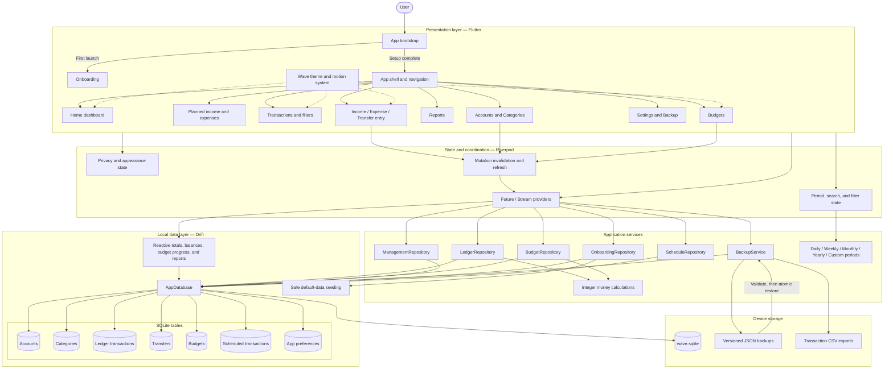
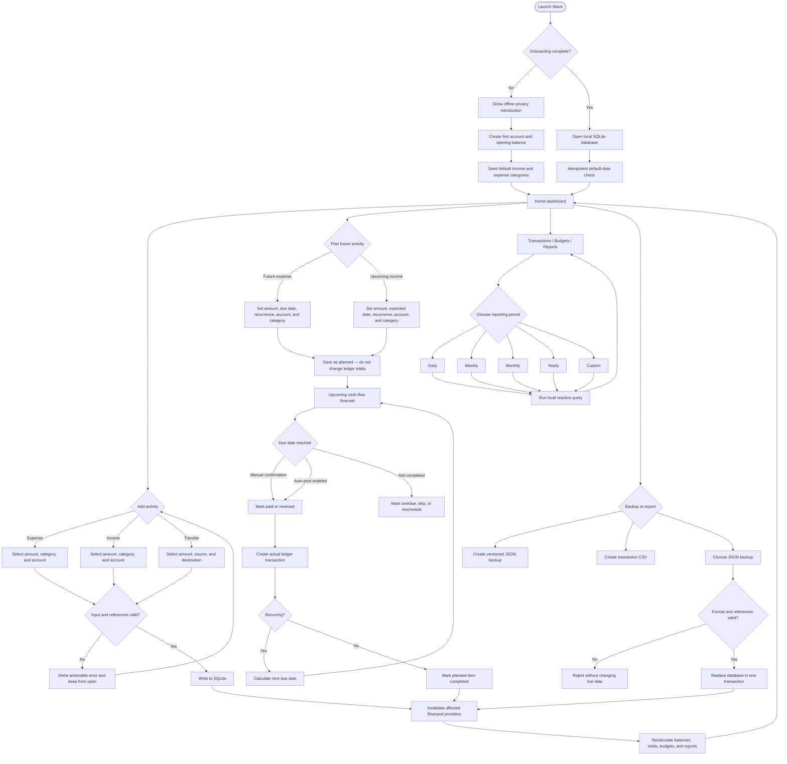
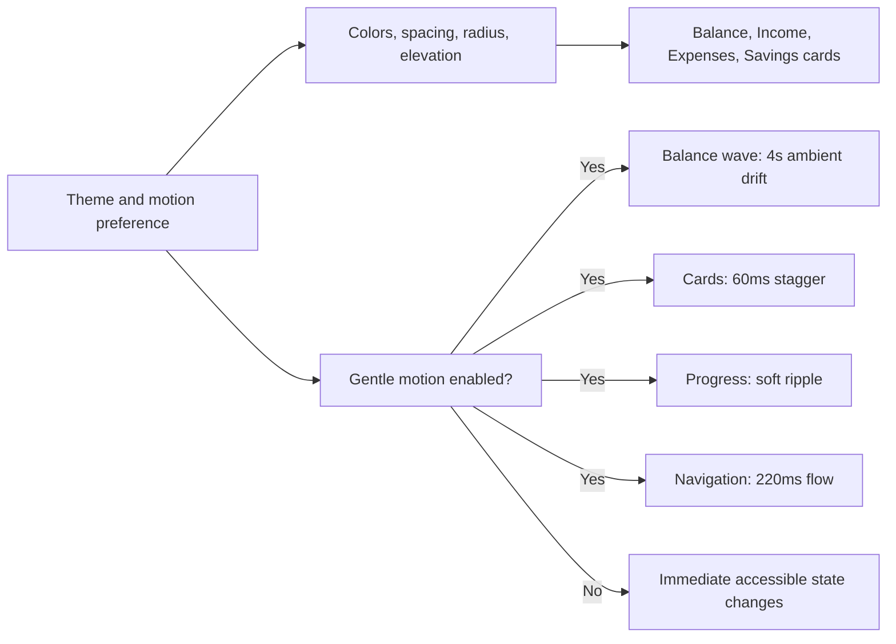

# Wave System Architecture

Wave is an offline-first Flutter application. Financial data stays on the device in SQLite; the app does not require login, cloud sync, or a bank connection.

## System architecture



## Main application flow



## Ledger rules

Wave stores money as integer minor units to avoid floating-point rounding errors.

```text
account balance = opening balance
                + income
                - expenses
                + incoming transfers
                - outgoing transfers
```

Transfers are separate records and never count as income or expense. Accounts and categories can be archived while historical records retain their references.

Planned income and expenses are also separate from the ledger. They appear in forecasts but do not affect actual balances, budgets, or reports until they are posted as real transactions.

## Data ownership and boundaries

- SQLite is the source of truth.
- Riverpod providers expose reactive, derived views of local data.
- Repositories validate mutations before writing.
- Backup restore validates the entire payload before changing live data.
- Restore replacement is atomic: either every valid record is restored or none are.
- JSON and CSV files are written to Wave's application documents directory.
- No financial records are intentionally transmitted over the network.

## Proposed dashboard theme and motion integration

The revised UI/UX concept fits entirely inside the presentation layer. It does not require changing the ledger or database model.



Motion should never delay input, obscure financial values, or be required to understand status. The reduced-motion path presents the same information without animation.
