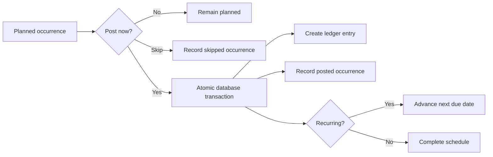
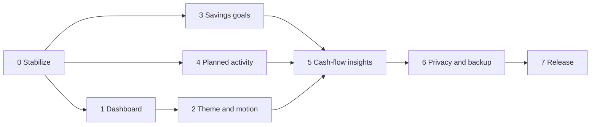

# Wave Development Phase Plan

This roadmap starts from the current offline MVP and incorporates the revised card-based dashboard, savings goals, future expenses, upcoming income, recurring schedules, Wave themes and motion, privacy controls, and release preparation.

## Product rule for planned activity

Planned income and expenses must remain separate from the actual ledger.

- Planned records appear in forecasts and upcoming lists.
- They do not change account balances, spending totals, budgets, or reports.
- A planned record affects actual finances only after it is posted as a ledger transaction.
- Transfers remain separate and never count as income or expense.
- Recurring rules create future occurrences without duplicating actual transactions.

## Phase 0 — Stabilization and regression protection

Goal: make the current account and ledger workflows dependable before expanding the data model.

Deliverables:

- Widget tests for account creation and editing
- Widget tests for income, expense, and transfer entry
- Active account/category validation in every repository mutation
- Hardened budget and onboarding forms with visible validation and reliable error recovery
- Duplicate-submission protection
- Complete dashboard refresh behavior
- Upgrade testing from Wave 1.0.0 and 1.0.1 without data loss
- Testing on an Android emulator and physical Android device

Exit criteria:

- Account, income, expense, and transfer flows work repeatedly without restart
- Static analysis is clean
- Unit, repository, and critical widget tests pass
- Existing local data survives an APK update

## Phase 1 — Dashboard redesign using existing data

Goal: implement the approved Wave dashboard without requiring new database tables.

Deliverables:

- Revised balance hero with layered Wave artwork
- Separate Income, Expenses, and Net saved cards
- Savings rate derived from income and expense totals
- Daily spending average
- Previous-period comparison
- Consistent Today, Week, Month, Year, and Custom selectors
- Improved loading, empty, retry, and error states
- Responsive layouts for small and large phones

Definitions:

```text
net saved = income - expenses
savings rate = max(net saved, 0) / income
daily average = expenses / elapsed days in selected period
```

Exit criteria:

- Every dashboard number matches its underlying ledger query
- Hidden-balance mode protects every monetary card
- Cards remain readable with large text and narrow screens

## Phase 2 — Theme and Wave motion system

Goal: add the visual identity shown in the revised UI/UX while preserving accessibility.

Deliverables:

- Ocean Light, Deep Blue, and Calm Night themes
- Persistent theme and Gentle motion preferences
- Balance-wave ambient drift
- 60 ms dashboard-card stagger
- Soft progress ripple
- 220 ms page-flow transition
- Reduced-motion path with equivalent static states

Exit criteria:

- Theme and motion preferences survive restart
- Motion never delays input or hides values
- System reduced-motion settings are respected
- Light and dark themes meet accessible contrast targets

## Phase 3 — Savings goals

Goal: distinguish estimated net savings from money intentionally allocated to goals.

Data additions:

```text
savings_goals
- id
- name
- target_minor
- target_date nullable
- linked_account_id nullable
- color_value
- status: active | completed | archived
- created_at
- updated_at

savings_contributions
- id
- goal_id
- amount_minor
- occurred_at
- note nullable
- created_at
```

Deliverables:

- Create, edit, archive, and complete a goal
- Add or reverse a manual contribution
- Optional account linking
- Goal progress, history, and target-date indicators
- Savings dashboard card
- Backup and restore support
- Schema migration and migration tests

Exit criteria:

- Goal allocations never inflate account balances or income
- Contributions and reversals produce correct progress
- Backup compatibility behavior is explicit and tested

## Phase 4 — Planned future income and expenses

Goal: let users schedule one-time or recurring activity and see upcoming cash flow without modifying actual balances.

Data addition:

```text
scheduled_transactions
- id
- type: income | expense
- amount_minor
- account_id
- category_id
- note nullable
- next_due_at
- recurrence: none | daily | weekly | monthly | yearly | custom
- recurrence_interval
- end_at nullable
- auto_post
- reminder_enabled
- reminder_offset_minutes nullable
- status: active | paused | completed
- last_posted_at nullable
- created_at
- updated_at
```

Occurrence states:

- Upcoming
- Due today
- Overdue
- Posted
- Skipped
- Rescheduled

Deliverables:

- Add a future expense or upcoming income
- One-time and recurring schedules
- Planned list grouped by date and status
- Edit, pause, resume, skip, reschedule, and delete
- Mark as paid or received
- Optional automatic posting
- Duplicate-post protection
- Reliable next-due-date calculation
- Upcoming expense and income dashboard cards
- 7-day, 30-day, and selected-period forecasts
- Optional device-local reminders
- Backup, restore, and CSV support

Posting flow:



Exit criteria:

- Planned items never affect actual totals before posting
- The same occurrence cannot be posted twice
- Monthly dates handle short months and leap years correctly
- Overdue, skip, reschedule, and pause behavior is tested
- Forecast totals reconcile with planned occurrences

## Phase 5 — Cash-flow insights and safe-to-spend

Goal: combine actual and planned data into useful forward-looking guidance.

Deliverables:

- Cash-flow screen from the revised concept
- Actual income-versus-expense chart
- Forecast overlay for planned activity
- Upcoming bills and income timeline
- Safe-to-spend estimate
- Period comparison and explanatory labels
- Clear distinction between actual and forecast values

Initial formula:

```text
safe to spend = available balance
              - upcoming planned expenses
              - protected savings allocations
```

The UI must describe this as an estimate, not financial advice.

Exit criteria:

- Actual and forecast values cannot be confused
- Forecast calculations are deterministic and tested
- Negative safe-to-spend states provide actionable warnings

## Phase 6 — Privacy, backup, and data ownership

Goal: improve protection and make offline data portable.

Deliverables:

- Functional Privacy settings screen
- Optional PIN lock and biometric unlock
- Configurable automatic-lock timeout
- Hide financial values when backgrounded
- Android share sheet for JSON and CSV
- Import backup from Files or Downloads
- User-selected export destination
- Transfers, savings, and schedules included in exports
- Backup checksum and compatibility metadata
- Last successful backup status and optional reminder

Exit criteria:

- Lock features cannot permanently block data recovery
- Invalid backups cannot partially change the database
- Backups restore all supported tables and relationships
- The app remains fully usable without internet access

## Phase 7 — Release verification and packaging

Goal: produce a dependable installable release candidate.

Deliverables:

- Full unit, repository, widget, migration, and integration test runs
- Screen-reader, large-text, contrast, and reduced-motion audits
- Small-screen and tablet layout checks
- Performance check with a large ledger
- Fresh-install, update, backup, restore, and rollback test matrix
- Production signing key stored outside the repository
- Signed APK and AAB
- Release notes, privacy statement, and known limitations

Exit criteria:

- No critical or high-severity open defects
- Release build installs and upgrades on physical Android devices
- Backup and restore are verified before release
- Source, documentation, and artifacts use the same version

## Phase dependencies



Phases 2, 3, and 4 can be developed independently after Phase 0. The full Phase 5 experience depends on themes, savings goals, and planned activity.

## Phase 12 — Automated release hardening

Goal: cover release risks that can be verified without a physical device.

Deliverables:

- Version 1 to current-schema migration preservation test
- Large-ledger dashboard, balance, report, and activity query check
- Narrow-phone and 200% text-scale coverage for the critical account flow
- Responsive account cards and dropdown fields
- Full static analysis and automated regression suite

Exit criteria:

- Legacy account and transaction data survives migration
- Core queries complete with at least 5,000 ledger entries
- The tested critical flow has no render overflow at 320 px width and 200% text
- Static analysis and all automated tests pass

## Recommended immediate next phase

Start with Phase 0. The recent account and transaction initialization defect showed that critical workflows need widget and update-path coverage before schema expansion. After Phase 0 exits cleanly, implement the existing-data dashboard cards in Phase 1 while finalizing the savings and scheduled-transaction schemas.
