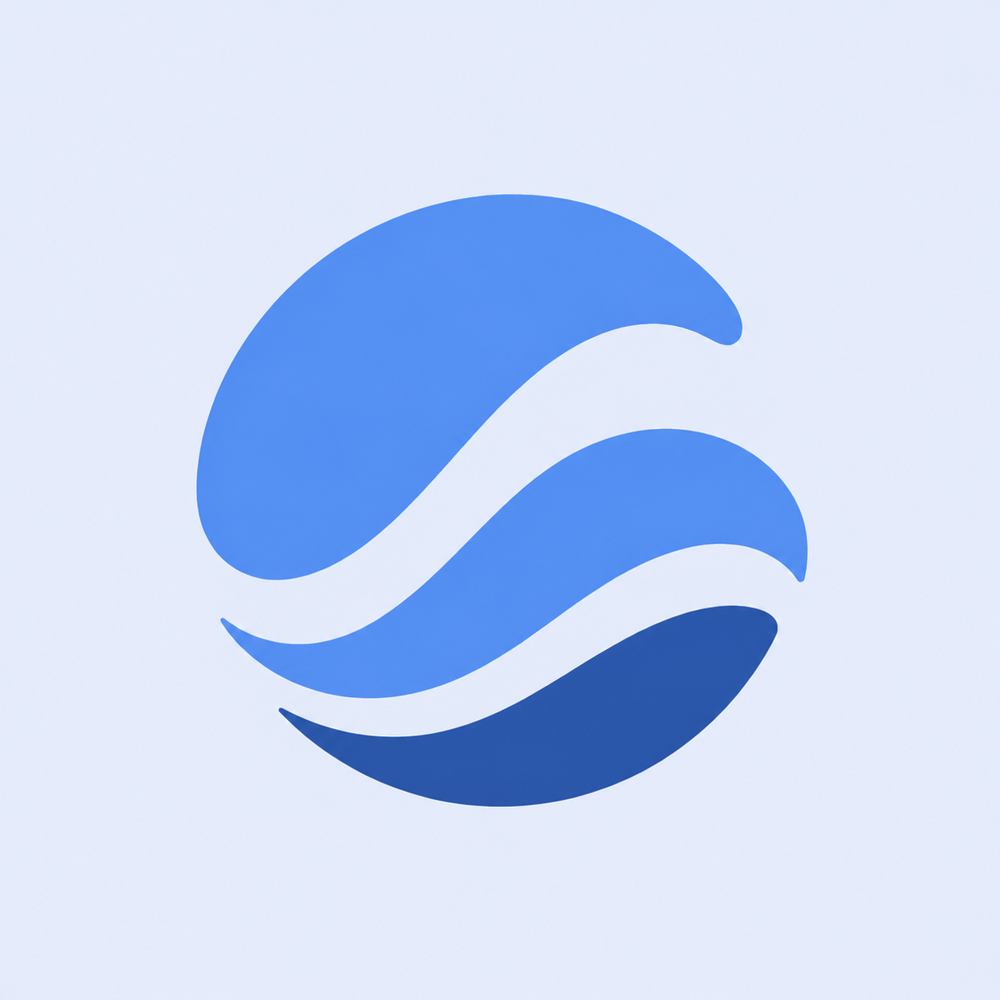
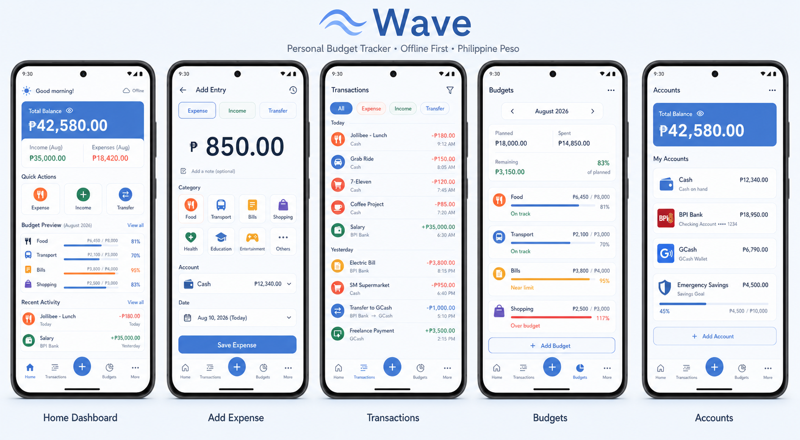
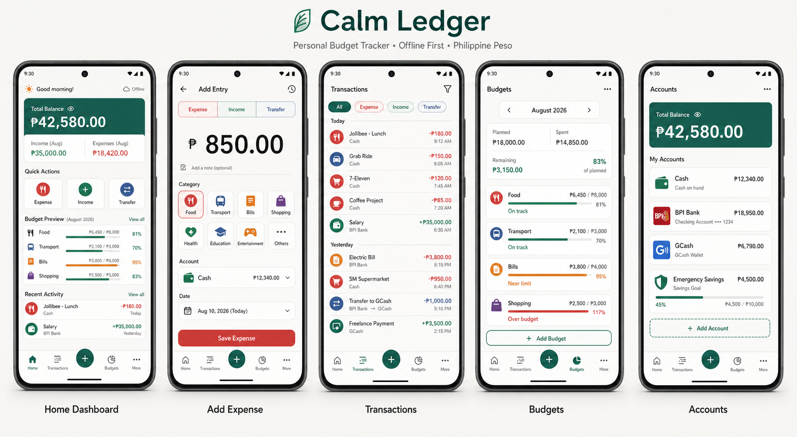

# Wave

**A calm, private, offline-first personal budget tracker built with Flutter.**

Wave helps you understand where your money goes without requiring an account, an internet connection, or access to your bank. Record expenses and income, move money between your own accounts, set monthly budgets, and review spending trends—all while keeping your financial records on your device.

> Wave is currently an offline release candidate. Automated verification and Android packaging are complete; physical-device verification is still required.

[Download the latest Android release](https://github.com/reynanmontejo/wave-budget-tracker/releases/latest)

## Why Wave?

Personal finance tools often require cloud accounts, subscriptions, or bank access. Wave takes a simpler approach:

- **Private by default** — Financial records are stored locally.
- **Works offline** — Core features never depend on an internet connection.
- **Fast entry** — The interface is designed around recording a repeat transaction in under five seconds.
- **Clear, not complicated** — Income, expenses, and transfers remain distinct so reports stay accurate.
- **Your backups, your control** — Export versioned JSON backups or transaction CSV files at any time.

## Current features

### Transactions

- Record expenses and income using integer-based money calculations
- Transfer money between accounts without inflating income or expenses
- Edit transaction and transfer details
- Change transaction dates
- Search by category, account, note, or amount
- Filter by period, type, account, and category
- Recover deleted activity with Undo

### Accounts and categories

- Track cash, bank, e-wallet, savings, and other account types
- Calculate balances from the complete ledger
- Create, edit, and archive accounts
- Use preset or custom income and expense categories
- Rename or archive categories without breaking historical records

### Budgets and reports

- Set monthly category budgets
- See planned, spent, and remaining amounts
- On track, Near limit, and Over budget states
- Daily, weekly, monthly, yearly, and custom date ranges
- Income-versus-expense summaries
- Previous-period comparisons
- Category spending breakdowns
- Adaptive spending trend charts

### Privacy and data ownership

- No login or cloud account
- Persistent hide/show balance preference
- Versioned JSON backups
- Backup validation before live data changes
- Atomic full-database restore
- CSV transaction export
- In-app backup history
- Password-encrypted backups with integrity verification
- PIN lock, recovery code, biometric unlock, and Android screen protection
- Weekly local backup reminders

### Planning and savings

- Savings goals with contribution history
- One-time and recurring future income or expenses
- Optional automatic posting when Wave opens
- Device-local reminders and cash-flow forecasts
- Estimated safe-to-spend guidance

### First launch

- Offline privacy introduction
- PHP as the MVP currency
- First-account setup
- Opening balance entry
- Wave-branded launcher icon and Android splash screen

## Design

Wave uses a soft-blue visual system called **Calm Ledger**: airy surfaces, clear numeric hierarchy, restrained semantic colors, and large touch targets.



### UI/UX previews

#### Final Wave direction

The selected soft-blue experience covers the core journey: checking the dashboard, adding an expense, reviewing transactions, monitoring budgets, and managing accounts.



#### Early visual exploration

The original Calm Ledger concept established the layout, information hierarchy, and privacy-first budgeting experience before the palette evolved into Wave blue.



The complete design proposal is available in [UI_UX_PROPOSAL.md](UI_UX_PROPOSAL.md). The product and implementation plan is documented in [APP_PLAN.md](APP_PLAN.md).

## Technology

| Layer | Technology |
|---|---|
| Framework | Flutter |
| Language | Dart |
| Local database | Drift + SQLite |
| State management | Riverpod |
| Formatting | intl |
| IDs | UUID |
| Charts | Flutter-native custom painting |

Money is stored as integer minor units rather than floating-point values. Account balances are derived from the ledger:

```text
opening balance
+ income
- expenses
+ incoming transfers
- outgoing transfers
```

Transfers are stored separately from income and expenses, keeping cash-flow reports accurate.

## Project structure

```text
lib/
├── core/            # Money, period, and theme primitives
├── data/            # Drift database, repositories, backup, and providers
└── features/        # Home, ledger, budgets, reports, onboarding, and settings

test/
├── core/            # Money and calendar-period tests
└── data/            # Ledger, budget, backup, reporting, and management tests
```

## Getting started

### Requirements

- Flutter stable
- Dart SDK included with Flutter
- Android Studio and Android SDK for Android builds
- Xcode on macOS for iOS builds

### Install and verify

```sh
flutter pub get
dart run build_runner build
flutter analyze
flutter test
```

### Run

```sh
flutter run
```

Drift's generated database file is committed so the project can be analyzed immediately. Run the generator whenever the database schema changes.

## Testing status

- Static analysis: clean
- Automated tests: 67 passing
- Ledger and transfer calculations: covered
- Budget period isolation: covered
- Backup round-trip and malformed-backup rejection: covered
- Onboarding and preference persistence: covered
- Version 1 database upgrade preservation: covered
- 5,000-entry ledger queries: covered
- Narrow-screen account flow at 200% text: covered
- Android APK/AAB release-candidate build: complete
- Android emulator and physical-device verification: pending
- iOS build verification: pending

## Backup behavior

Wave stores backups in a `wave_backups` directory inside the application's documents folder.

The JSON format contains:

- A stable format identifier
- Schema version
- Export timestamp
- Accounts
- Categories
- Transactions
- Transfers
- Budgets
- Savings goals and contributions
- Planned and recurring transactions

Restore validates the complete file and its relationships before replacing live data. The replacement runs inside a single database transaction.

## MVP scope

Wave currently supports one reporting currency, PHP. The following are intentionally outside the offline MVP:

- Cloud sync and multiple devices
- Bank API connections
- Receipt scanning and OCR
- Automatic currency conversion
- Shared household accounts
- Investment portfolio valuation

## Roadmap

- Complete Android SDK and device verification
- Resolve issues found during hands-on testing
- Complete screen-reader and device-level accessibility validation
- Configure production signing for a future store release
- iOS build and splash-screen verification

## Privacy

Wave does not require an account and does not intentionally transmit financial records. Users are responsible for copying backups away from the device if protection against device loss is required.

## Repository status

Wave is an early personal-finance project, not financial advice or production banking software. Review the implementation and test it with non-critical data before relying on it for record keeping.
