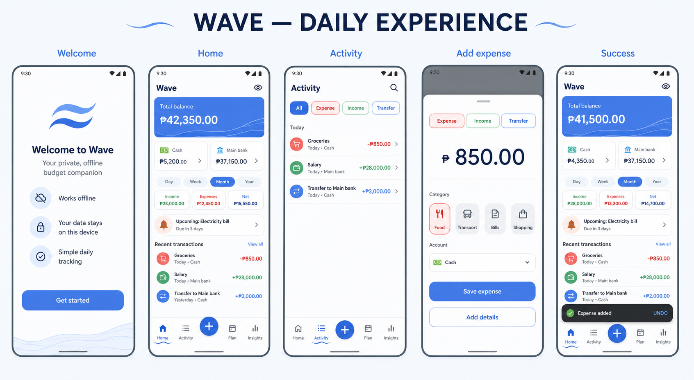
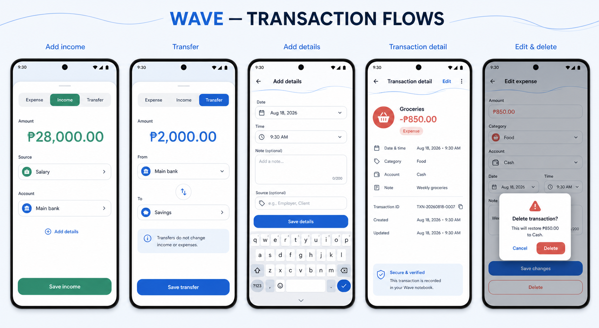
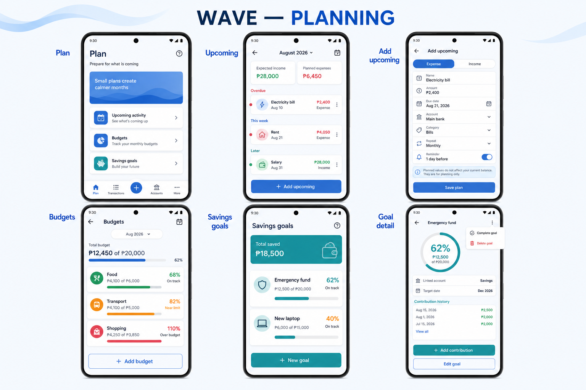
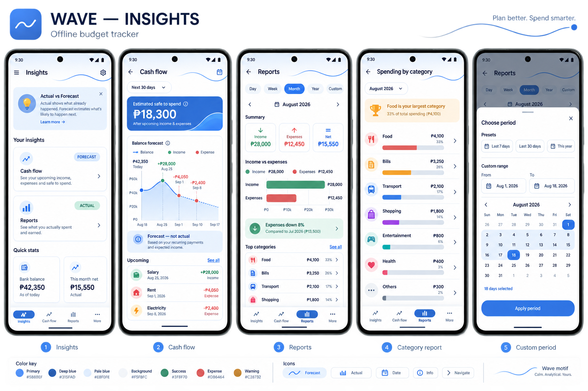
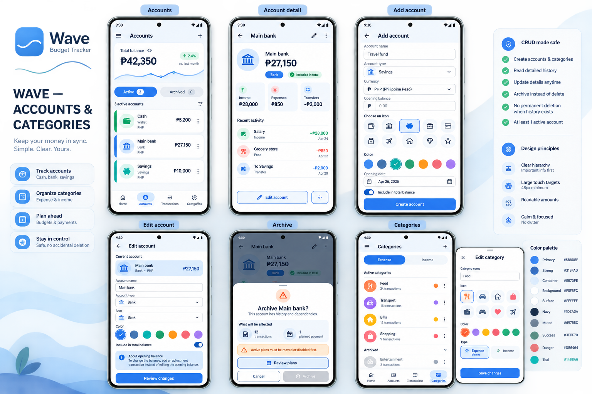
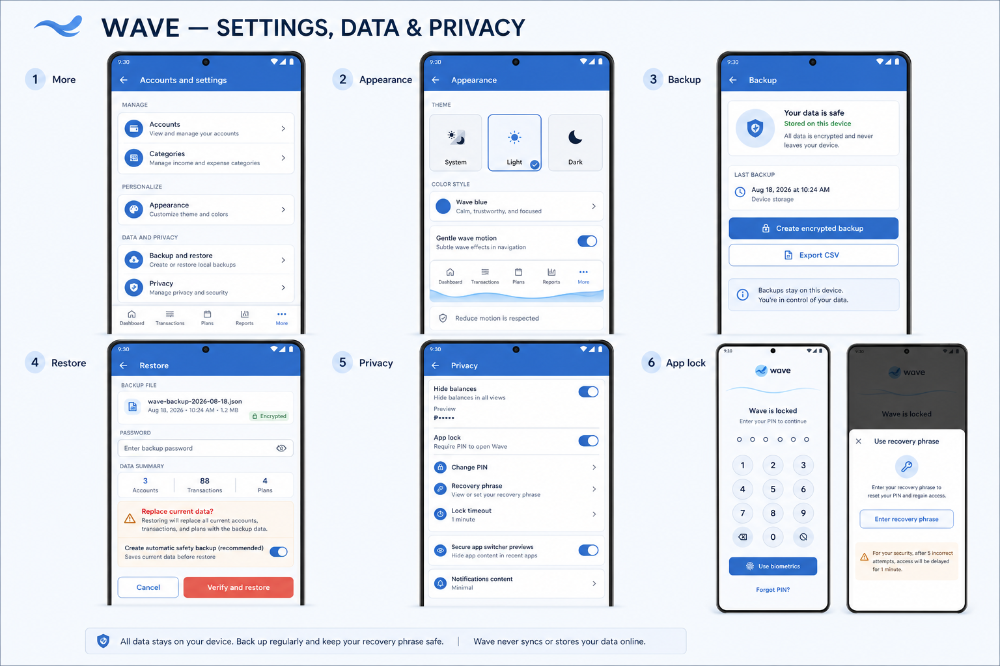
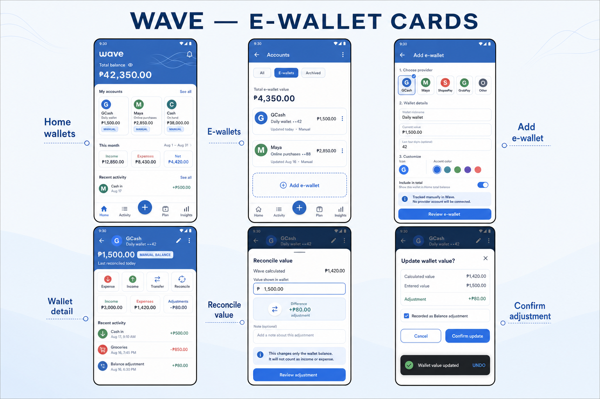

# Wave UI/UX Review Boards

These high-fidelity concept boards cover the current Wave application and its
critical interaction states. They are design references, not pixel-perfect
captures of the Flutter implementation.

## 1. Daily experience

Covers onboarding, Home, Activity, quick expense entry, and save confirmation.

## 2. Transaction flows

Covers income, transfer, optional details, transaction detail, editing, and
confirmed deletion.

## 3. Planning

Covers the Plan hub, upcoming expenses and income, planned-entry creation,
budgets, savings goals, and goal details.

## 4. Insights

Covers the Insights hub, forecast cash flow, actual reports, category analysis,
and custom date ranges.

## 5. Accounts and categories

Covers account cards, account details, create/update/archive behavior, and
category management.

## 6. Settings, data, and privacy

Covers the More hub, appearance, local backup, protected restore, privacy
controls, app lock, and PIN recovery.

## 7. E-wallet cards and manual values

Covers compact Home wallet cards, the E-wallets account filter, wallet creation,
wallet details, manual value reconciliation, adjustment confirmation, and Undo.
The design intentionally avoids any suggestion that Wave connects to or
synchronizes with an external wallet provider.

## Review criteria

- The primary action is obvious without scrolling.
- Financial values have clear labels and do not rely on color alone.
- Account, transaction, and planned-entry consequences are explained before
  confirmation.
- Cards help scanning without making Home feel heavy.
- Wave decoration supports navigation and identity without competing with data.
- Every critical screen remains understandable at large text sizes.
- Offline storage, backup, restore, and forecast semantics are explicit.
- E-wallet values are clearly identified as manual and balance adjustments do
  not appear as income or expenses.
